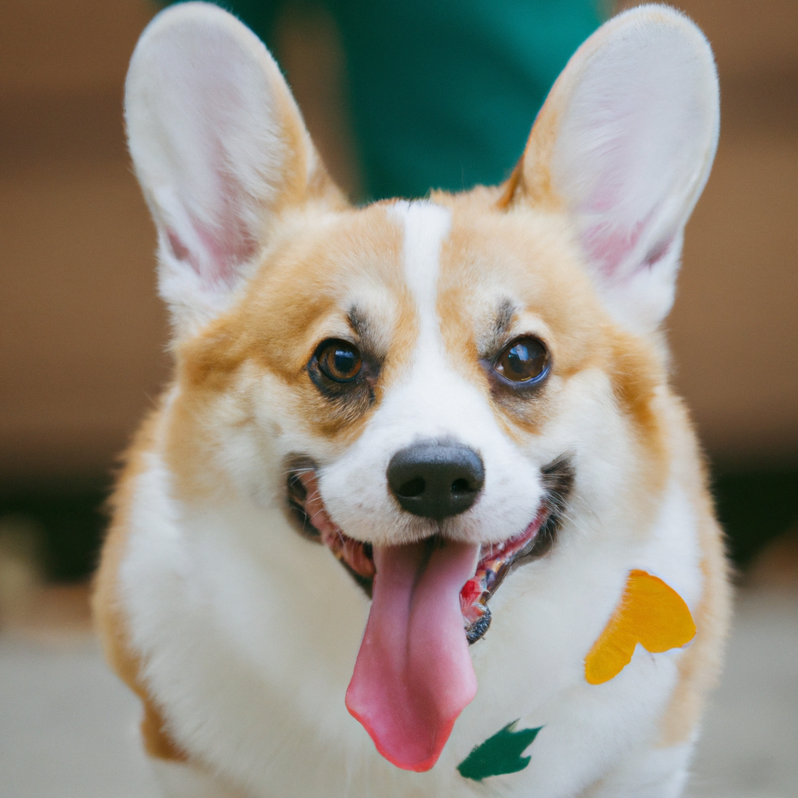
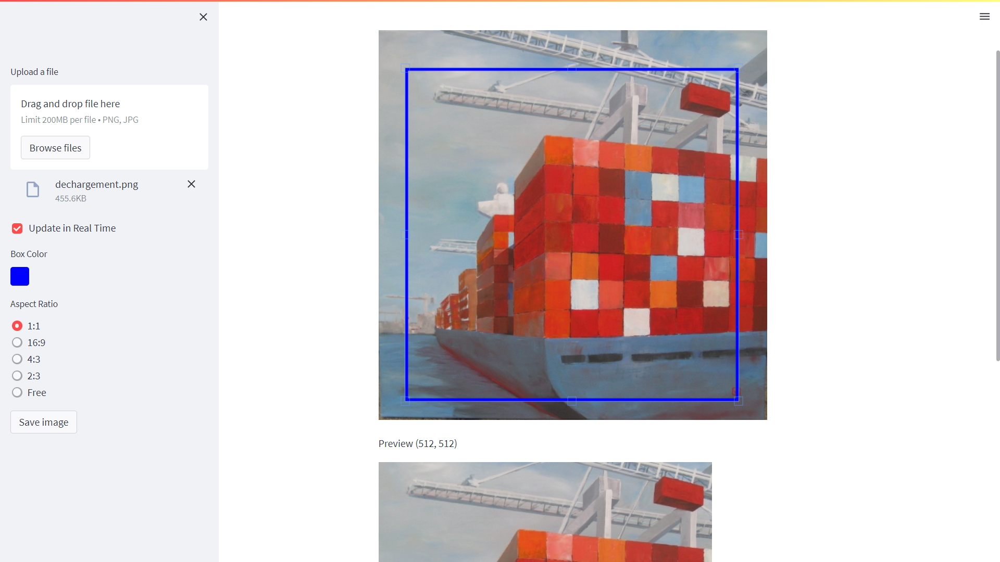
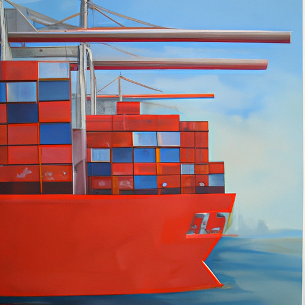
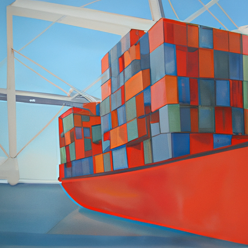

# 🤖 OpenAI

Test OpenAI API

## DALL-E

```python
import openai

response = openai.Image.create(
  prompt="a funny corgi",
  n=1,
  size="512x512"
)
image_url = response['data'][0]['url']
```



## Image processing

Call to OpenAI API requires png image of the right size (e.g. 512x512). 

Two options to crop image:

### Streamlit app

https://github.com/turner-anderson/streamlit-cropper



### MATLAB Image tool

https://www.mathworks.com/help/images/ref/imageviewer-app.html


## Image variation







## Resources:

* [DALL·E 2](https://openai.com/dall-e-2/)
* [DALL·E Editor Guide](https://help.openai.com/en/articles/6516417-dall-e-editor-guide)
* https://labs.openai.com/editor
