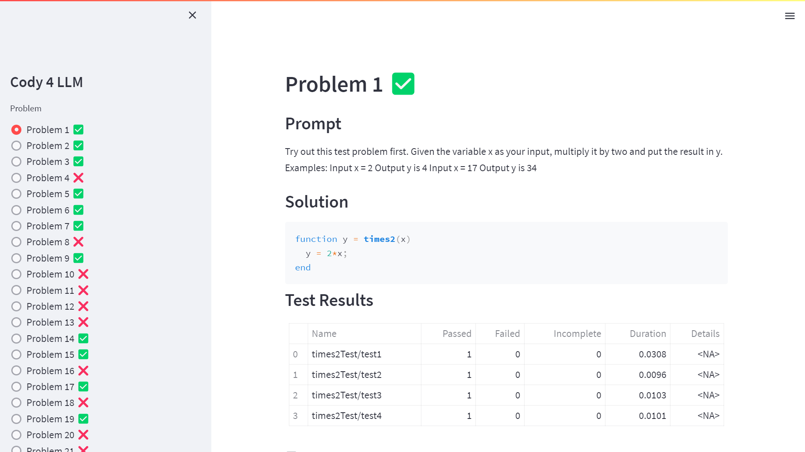
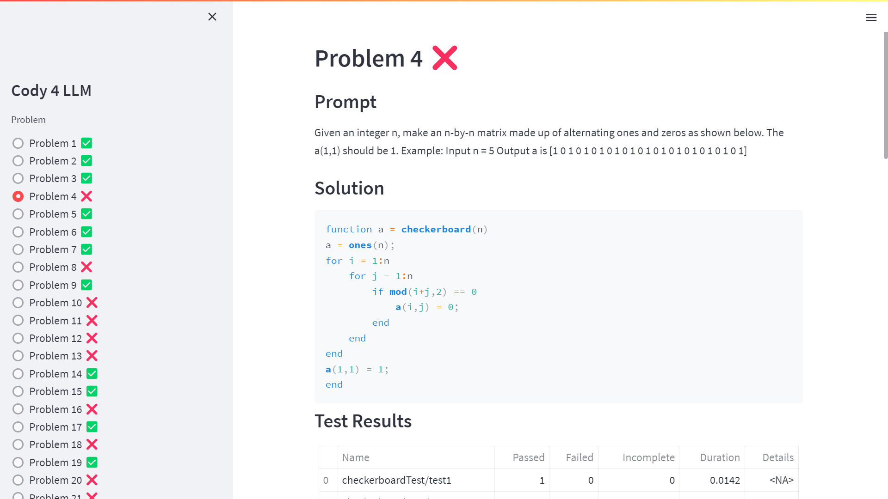

# Cody LLM testbench

Use Cody challenges to assess the performance of LLMs on MATLAB code


## 1. Scrape Cody

[Problem 1. Times 2 - START HERE](https://www.mathworks.com/matlabcentral/cody/problems/1)

### Problem

Try out this test problem first.
Given the variable x as your input, multiply it by two and put the result in y.
Examples:
```
 Input  x = 2
 Output y is 4

 Input  x = 17
 Output y is 34
```

## 2. Use LLM to solve Cody

### Solution

```matlab
function y = times2(x) % Do not edit this line.

  % Modify the line below so that the output y is twice the incoming value x

  y = 2*x;

  % After you modify the code, press the "Submit" button, and you're on your way.

end % Do not edit this line.
```

## 3. Test LLM solution

### Test

```matlab
%% test 1
assert(isequal(times2(1),2));
%% test 2
assert(isequal(times2(11),22));
%% test 3
assert(isequal(times2(-3),-6));
%% test 4
assert(isequal(times2(29),58));
```

### Dashboard




## Resources

- https://github.com/slevin48/automate