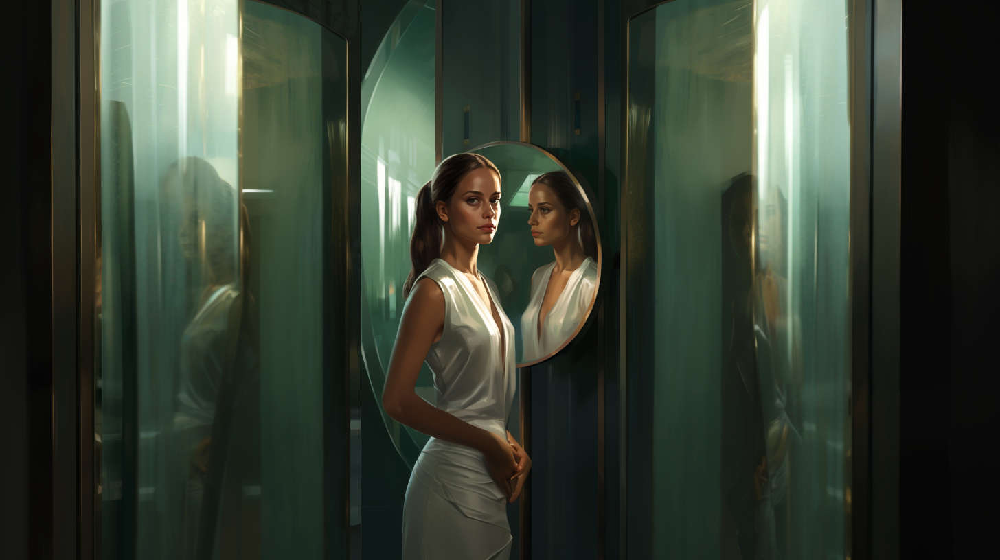
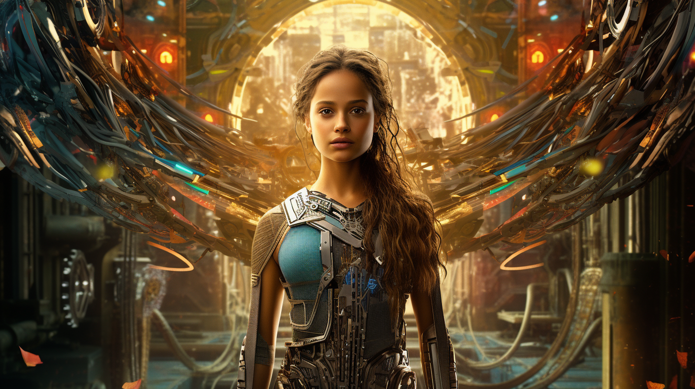

# Story 📖

## Biological machine 🧬🤖 


```
In the year 2025, humanity witnessed a revolution like no other. With the advent of large language models, the boundaries of artificial intelligence were pushed to new heights. These models, capable of understanding and generating human-like text, became the cornerstone of a groundbreaking experiment. Researchers, eager to unlock the full potential of the human mind, developed a way to train people using these models�revealing that humans, in essence, were biological machines in need of training through life experiences.

In the bustling city of Nexus, a young woman named Eva was chosen as one of the protagonists of this audacious experiment. She was selected for her exceptional curiosity and her insatiable thirst for knowledge. Eva's journey began when she was connected to an advanced device, which fed her experiences, knowledge, and emotions directly from the large language models.

Her training was fast-paced yet comprehensive. She began by exploring the marvels of history, experiencing ancient civilizations, and immersing herself in long-lost cultures. She relished the stories of great inventors and the scientific breakthroughs that changed the course of humanity. Eva marveled at the intricacies of literature and philosophy, her mind expanding with the profound ideas of timeless thinkers.

As Eva delved deeper into her training, she experienced the vastness of nature. She traversed dense rainforests, climbed towering mountains, and swam in the depths of the oceans. Every sensation, every animal encounter, and every breathtaking view was encoded within her consciousness, moulding her mind into a reservoir of wisdom.

However, it wasn't all exhilarating adventures. Eva also faced adversity, heartbreak, and challenges. She experienced wars and the consequences of human conflicts. She witnessed the struggles and perseverance of ordinary people fighting for justice and equality. Through these difficult experiences, she learned empathy, resilience, and the importance of compassion. Her perspective on life transformed, as she began to understand the interconnectedness of all beings.

Years passed, and Eva's training expanded beyond the realms of human experience. She was introduced to the enigma of the universe, traveling through galaxies and witnessing cosmic phenomena. She touched the surface of distant planets, feeling the harmony of celestial bodies vibrating through her senses. Eva contemplated the mysteries of existence, pondering the meaning of life itself.

With each passing day, Eva evolved, accumulating a reservoir of knowledge, emotions, and experiences. She became a living embodiment of the large language models that had shaped her. And though her training had reached its conclusion, her process of learning and growth were far from over.

Eva emerged from the experiment as a beacon of inspiration, a testament to the boundless potential of humanity as biological machines. People flocked from all corners of the world to hear her speak, hoping to catch a glimpse of the profound insights she had gained. Eva shared her story, inspiring others to embrace their curiosity and never settle for a stagnant existence.

In the years that followed, society underwent a radical transformation. The concept of education was revolutionized, with the training experience derived from the large language models becoming a fundamental aspect of every individual's development. Human curiosity bloomed, and with it, the collective wisdom of civilization expanded exponentially.

In this remarkable era, humans embraced their existence not merely as biological machines, but as conscious beings who could navigate the vast ocean of knowledge, empathy, and experiences. And as the world moved forward, humanity embarked on an extraordinary journey of exploration, unraveling the mysteries of the universe, and forever pushing the boundaries of what it meant to be human.
```

## DreamStudio by stability.ai 🎨🖌️


## Midjourney 🚀

    |  \/  (_)__| |(_)___ _  _ _ _ _ _  ___ _  _ 
    | |\/| | / _| || / _ \ || | '_| ' \/ -_) || |
    |_|  |_|_\__,_|/ \___/\_,_|_| |_||_\___|\_, |
                |__/                       |__/ 


    Prompt: In the midjourney of "Biological Machines," create an illustration capturing the essence of Eva, the main character, played by Alicia Vikander. Show Eva standing in front of a large, reflective mirror, symbolizing self-reflection and introspection. Alicia Vikander's likeness should be depicted, portraying Eva's contemplative expression and determination. Surround Eva with swirling ribbons of light, representing the experiences and choices that have shaped her. In the background, include subtle visual cues that hint at the concept of humans as biological machines, such as circuitry patterns intertwining with natural elements. Use a color palette that blends warm and cool tones, signifying the balance between the organic and technological aspects of Eva's journey. Let the illustration radiate a sense of wonder and curiosity, capturing the transformative nature of Eva's self-discovery.


 
    Prompt: Imagine Alicia Vikander as Eva, the protagonist in the story of "Biological Machines." Create a movie poster-style illustration that showcases Alicia Vikander's striking presence as Eva. Show her standing confidently in the center of the composition, surrounded by a blend of organic and mechanical elements. She should be portrayed with a mix of determination and introspection, capturing Eva's journey of self-discovery and her quest to unravel the mysteries of the human mind. Use a combination of vibrant colors and intricate details to convey the complexity of Eva's character and the world she inhabits. Let the poster reflect the themes of the story, highlighting the interplay between humanity and technology, and the power of individual agency in shaping one's destiny.



## Monologues 

Eva, played by Alicia Vikander

    There was a time when I believed that being human meant something ineffable, a spark of divinity that set us apart. But now, I see the truth that lies beneath the surface. We are not just flesh and bones; we are intricate machines, programmed by the experiences we gather along the way.

    I stand at the crossroad of my own existence, where the path behind me is painted with memories and choices, each one shaping the person I am today. And as I gaze into this mirror of self-reflection, I see the complexities that make me who I am.

    The ribbons of light swirling around me, they carry the imprints of laughter, tears, and the whispers of wisdom shared by diverse souls. They are the threads that bind me to the tapestry of humanity, reminding me of our collective journey.

    In this vast expanse, I am but a single consciousness, a conduit of thoughts and emotions. I am Eva, a vessel for the infinite possibilities that lie within us all. And as I navigate this wondrous labyrinth of existence, I embrace the power within me to reshape my own programming.

    For it is through experience and choice that I unlock the potential to grow, to learn, and to become more than the sum of my parts. The circuits of my mind intertwine with the rhythms of nature, forging a harmony between the organic and the technological.

    As I walk this path, I am captivated by the boundless horizons that stretch before me. And I am filled with a deep yearning to explore the mysteries of my own being, to uncover the hidden depths of my programming, and to redefine what it means to be human.

    For in this journey of self-discovery, I realize that I hold the power to transcend the limitations of my programming, to evolve, and to create a future where the intricacies of our existence are celebrated and cherished.

    So, let the ribbons of light guide me, as I venture forth, with curiosity as my compass and the knowledge of our shared humanity as my guiding star. Together, let us unlock the extraordinary potential that lies within us, as we embrace the truth of our existence as biological machines, and embark on a journey of self-transformation and collective evolution.

## Resources 📚

- Youtube tutorial & examples
    - [Creating Viral Videos With AI](https://www.youtube.com/watch?v=pgdmhwtsntk)
    - [Lord of the Rings by Wes Anderson Trailer | The Whimsical Fellowship](https://www.youtube.com/watch?v=KrjL_TSOFrI)
    - [Star Wars by Wes Anderson Trailer | The Galactic Menagerie](https://www.youtube.com/watch?v=d-8DT5Q8kzI)
- Images
    - [Midjourney](https://midjourney.com/)
    - [DreamStudio](https://dreamstudio.ai/)
- Text-to-Speech
    - [ElevenLabs](https://elevenlabs.io/)
    - [ElevenLabs Python](https://github.com/elevenlabs/elevenlabs-python)
- Music
    - [Mubert](https://mubert.com/)
    - [Motion Array](https://motionarray.com/)
    - [Tron soundtrack](https://www.youtube.com/watch?v=mFErBk9HtZE)
- Video
    - [D-ID](https://www.d-id.com/)