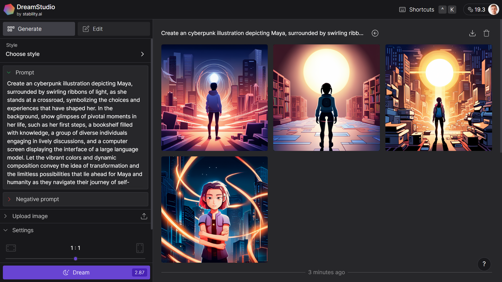

# Story 📖

## Biological machine 🧬🤖 


```
In the year 2025, humanity witnessed a revolution like no other. With the advent of large language models, the boundaries of artificial intelligence were pushed to new heights. These models, capable of understanding and generating human-like text, became the cornerstone of a groundbreaking experiment. Researchers, eager to unlock the full potential of the human mind, developed a way to train people using these models�revealing that humans, in essence, were biological machines in need of training through life experiences.

In the bustling city of Nexus, a young woman named Maya was chosen as one of the protagonists of this audacious experiment. She was selected for her exceptional curiosity and her insatiable thirst for knowledge. Maya's journey began when she was connected to an advanced device, which fed her experiences, knowledge, and emotions directly from the large language models.

Her training was fast-paced yet comprehensive. She began by exploring the marvels of history, experiencing ancient civilizations, and immersing herself in long-lost cultures. She relished the stories of great inventors and the scientific breakthroughs that changed the course of humanity. Maya marveled at the intricacies of literature and philosophy, her mind expanding with the profound ideas of timeless thinkers.

As Maya delved deeper into her training, she experienced the vastness of nature. She traversed dense rainforests, climbed towering mountains, and swam in the depths of the oceans. Every sensation, every animal encounter, and every breathtaking view was encoded within her consciousness, moulding her mind into a reservoir of wisdom.

However, it wasn't all exhilarating adventures. Maya also faced adversity, heartbreak, and challenges. She experienced wars and the consequences of human conflicts. She witnessed the struggles and perseverance of ordinary people fighting for justice and equality. Through these difficult experiences, she learned empathy, resilience, and the importance of compassion. Her perspective on life transformed, as she began to understand the interconnectedness of all beings.

Years passed, and Maya's training expanded beyond the realms of human experience. She was introduced to the enigma of the universe, traveling through galaxies and witnessing cosmic phenomena. She touched the surface of distant planets, feeling the harmony of celestial bodies vibrating through her senses. Maya contemplated the mysteries of existence, pondering the meaning of life itself.

With each passing day, Maya evolved, accumulating a reservoir of knowledge, emotions, and experiences. She became a living embodiment of the large language models that had shaped her. And though her training had reached its conclusion, her process of learning and growth were far from over.

Maya emerged from the experiment as a beacon of inspiration, a testament to the boundless potential of humanity as biological machines. People flocked from all corners of the world to hear her speak, hoping to catch a glimpse of the profound insights she had gained. Maya shared her story, inspiring others to embrace their curiosity and never settle for a stagnant existence.

In the years that followed, society underwent a radical transformation. The concept of education was revolutionized, with the training experience derived from the large language models becoming a fundamental aspect of every individual's development. Human curiosity bloomed, and with it, the collective wisdom of civilization expanded exponentially.

In this remarkable era, humans embraced their existence not merely as biological machines, but as conscious beings who could navigate the vast ocean of knowledge, empathy, and experiences. And as the world moved forward, humanity embarked on an extraordinary journey of exploration, unraveling the mysteries of the universe, and forever pushing the boundaries of what it meant to be human.
```

## DreamStudio by stability.ai 🎨🖌️





## Midjourney 🚀

    |  \/  (_)__| |(_)___ _  _ _ _ _ _  ___ _  _ 
    | |\/| | / _| || / _ \ || | '_| ' \/ -_) || |
    |_|  |_|_\__,_|/ \___/\_,_|_| |_||_\___|\_, |
                |__/                       |__/ 

